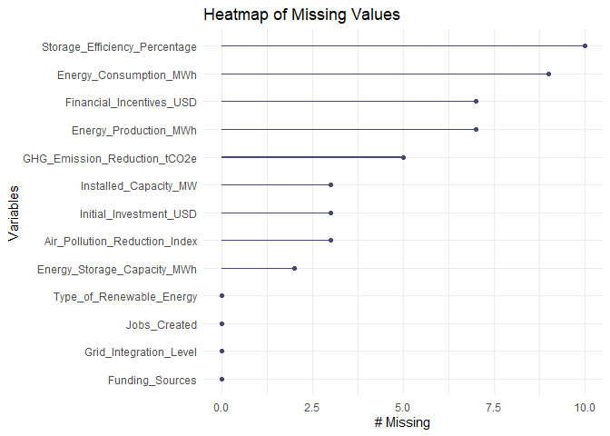
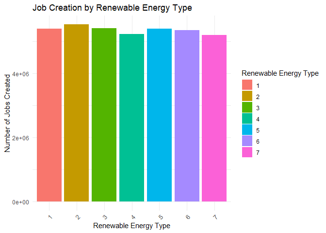

Renewable Energy Analysis Report
================
Farouk Daboussi
2024-08-21

<details>
<summary>
<strong>1. Project Overview</strong>
</summary>

The Renewable Energy Analysis Report aims to provide a comprehensive
evaluation of various renewable energy sources. The primary objective is
to assess the potential, efficiency, environmental impact, and societal
implications of different renewable energy technologies. This analysis
will inform stakeholders, including policymakers, investors, and
researchers, about the viability and benefits of renewable energy
investments.

Key areas of focus include:

- **Energy Production Potential**: Evaluating the installed capacity per
  unit land area and understanding seasonal and geographical variations
  in energy production.
- **Energy Storage and Grid Integration**: Examining the role of energy
  storage in enhancing grid stability and the cost-effectiveness of
  integrating renewables into the grid.
- **Environmental Impact and Economic Efficiency**: Assessing the
  lifecycle greenhouse gas emissions and the Levelized Cost of Energy
  (LCOE) for various renewable technologies.
- **Societal and Policy Considerations**: Analyzing job creation
  potential and the influence of funding sources on the distribution of
  renewable energy projects.

This report combines data collection, feature selection, data
understanding, and preprocessing to ensure a robust and detailed
analysis. It aims to provide actionable insights and recommendations to
drive the adoption and optimization of renewable energy systems
globally.

</details>
<details>
<summary>
<strong>2. Key Research Questions</strong>
</summary>

This section outlines the primary research questions that guide the
analysis in the Renewable Energy Analysis Report. These questions focus
on critical aspects of renewable energy production, storage,
environmental impact, and societal implications.

1.  **Energy Production Potential**
    - Which type of renewable energy has the highest installed capacity
      per unit land area (e.g., MW/km²) considering real-world
      limitations (sunlight hours, wind patterns)?
    - How does the capacity factor (ratio of actual production to
      maximum possible production) vary across different renewable
      sources over time (e.g., seasonal variations for solar)?
2.  **Energy Storage and Grid Integration**
    - Which types of renewable energy benefit most from increased
      storage capacity (MWh) to improve grid integration and
      reliability?
    - Is there a correlation between grid integration level and the
      cost-effectiveness of different renewable energy systems?
3.  **Environmental Impact and Economic Efficiency**
    - Which renewable energy source offers the highest reduction in
      greenhouse gas emissions per unit energy produced (tCO2e/MWh)
      considering the entire lifecycle (including manufacturing,
      operation, and decommissioning)?
    - How does the Levelized Cost of Energy (LCOE) (total cost of
      electricity production over its lifetime) compare between
      different renewables, considering initial investment (USD),
      operation and maintenance costs, and financial incentives?
4.  **Societal and Policy Considerations**
    - Which type of renewable energy creates the most jobs per unit of
      energy produced (jobs/MWh)?
    - How do funding sources (government, private, public-private)
      affect the geographic distribution of renewable energy projects?

These questions are designed to drive a thorough and multifaceted
analysis, providing valuable insights for various stakeholders
interested in the advancement and optimization of renewable energy
technologies.

</details>
<details>
<summary>
<strong>3. Technical Approach</strong>
</summary>

1.  <details>
    <summary>

    <strong>Data Collection</strong>

    </summary>

    The dataset was collected from various reliable sources, including
    government databases, industry reports, and academic research. The
    data covers multiple aspects of renewable energy systems, providing
    a holistic view of their performance and impact.

    ``` r
    # Load the readr package
    library(readr)

    # Read the CSV file
    renewable_energy_data <- read_csv("energy_dataset.csv")
    ```

        ## Rows: 15000 Columns: 13
        ## ── Column specification ────────────────────────────────────────────────────────────────────────────────────
        ## Delimiter: ","
        ## dbl (13): Type_of_Renewable_Energy, Installed_Capacity_MW, Energy_Production_MWh, Energy_Consumption_MWh...
        ## 
        ## ℹ Use `spec()` to retrieve the full column specification for this data.
        ## ℹ Specify the column types or set `show_col_types = FALSE` to quiet this message.

    ``` r
    # Display the first few rows of the dataset
    kable(head(renewable_energy_data), caption = "First 5 Rows of Renewable Energy Dataset")
    ```

    | Type_of_Renewable_Energy | Installed_Capacity_MW | Energy_Production_MWh | Energy_Consumption_MWh | Energy_Storage_Capacity_MWh | Storage_Efficiency_Percentage | Grid_Integration_Level | Initial_Investment_USD | Funding_Sources | Financial_Incentives_USD | GHG_Emission_Reduction_tCO2e | Air_Pollution_Reduction_Index | Jobs_Created |
    |-------------------------:|----------------------:|----------------------:|-----------------------:|----------------------------:|------------------------------:|-----------------------:|-----------------------:|----------------:|-------------------------:|-----------------------------:|------------------------------:|-------------:|
    |                        4 |              93.42321 |              103853.2 |               248708.5 |                    2953.249 |                      89.88756 |                      4 |              473224764 |               1 |                  9207772 |                     6663.817 |                     81.742461 |         1366 |
    |                        4 |             590.46894 |              190223.1 |               166104.2 |                    5305.174 |                      84.40334 |                      4 |              167069722 |               2 |                  1685101 |                    30656.050 |                     78.139042 |         1743 |
    |                        1 |             625.95114 |              266023.5 |               424114.6 |                    2620.193 |                      60.49825 |                      2 |               84636100 |               2 |                  5111813 |                     1749.614 |                      8.461296 |          363 |
    |                        1 |             779.99873 |              487039.5 |               308337.7 |                    1925.250 |                      86.89786 |                      3 |              396768982 |               2 |                  4805902 |                    43233.238 |                      8.402441 |         2821 |
    |                        3 |             242.10684 |              482815.1 |               360437.8 |                    3948.945 |                      70.94935 |                      2 |               35744128 |               1 |                 16686014 |                    14858.663 |                     28.822867 |         2583 |
    |                        1 |             596.17463 |              292384.5 |               415449.6 |                    9767.234 |                      50.90191 |                      3 |              449150518 |               2 |                 11315379 |                    16089.626 |                      9.038487 |          309 |

    First 5 Rows of Renewable Energy Dataset

    </details>

2.  <details>
    <summary>

    <strong>Feature Selection</strong>

    </summary>

    Relevant features were selected based on their importance to the key
    research questions and their potential to provide meaningful
    insights:

    - **Type_of_Renewable_Energy**: Numerical code representing the type
      of renewable energy source (1: Solar, 2: Wind, 3: Hydroelectric,
      4: Geothermal, 5: Biomass, 6: Tidal, 7: Wave).
    - **Installed_Capacity_MW**: Installed capacity in megawatts (MW).
    - **Energy_Production_MWh**: Yearly energy production in
      megawatt-hours (MWh).
    - **Energy_Consumption_MWh**: Yearly energy consumption in
      megawatt-hours (MWh).
    - **Energy_Storage_Capacity_MWh**: Energy storage capacity in
      megawatt-hours (MWh).
    - **Storage_Efficiency_Percentage**: Efficiency of energy storage
      systems in percentage.
    - **Grid_Integration_Level**: Numerical code representing the level
      of grid integration (1: Fully Integrated, 2: Partially Integrated,
      3: Minimal Integration, 4: Isolated Microgrid).
    - **Initial_Investment_USD**: Initial investment costs in USD.
    - **Funding_Sources**: Numerical code representing the funding
      source (1: Government, 2: Private, 3: Public-Private Partnership).
    - **Financial_Incentives_USD**: Financial incentives in USD.
    - **GHG_Emission_Reduction_tCO2e**: Reduction in greenhouse gas
      emissions in tons of CO2 equivalent (tCO2e).
    - **Air_Pollution_Reduction_Index**: Air pollution reduction index.
    - **Jobs_Created**: Number of jobs created.

    </details>

3.  <details>
    <summary>

    <strong>Data Understanding</strong>

    </summary>

    Explanation of techniques to understand the dataset.

    1.  <details>
        <summary>

        <strong>Summary Statistics</strong>

        </summary>
        <table>
        <caption>

        Summary Statistics of Renewable Energy Dataset

        </caption>
        <thead>
        <tr>
        <th style="text-align:left;">
        </th>
        <th style="text-align:left;">

        Type_of_Renewable_Energy

        </th>
        <th style="text-align:left;">

        Installed_Capacity_MW

        </th>
        <th style="text-align:left;">

        Energy_Production_MWh

        </th>
        <th style="text-align:left;">

        Energy_Consumption_MWh

        </th>
        <th style="text-align:left;">

        Energy_Storage_Capacity_MWh

        </th>
        <th style="text-align:left;">

        Storage_Efficiency_Percentage

        </th>
        <th style="text-align:left;">

        Grid_Integration_Level

        </th>
        <th style="text-align:left;">

        Initial_Investment_USD

        </th>
        <th style="text-align:left;">

        Funding_Sources

        </th>
        <th style="text-align:left;">

        Financial_Incentives_USD

        </th>
        <th style="text-align:left;">

        GHG_Emission_Reduction_tCO2e

        </th>
        <th style="text-align:left;">

        Air_Pollution_Reduction_Index

        </th>
        <th style="text-align:left;">

        Jobs_Created

        </th>
        </tr>
        </thead>
        <tbody>
        <tr>
        <td style="text-align:left;">
        </td>
        <td style="text-align:left;">

        Min. :1.000

        </td>
        <td style="text-align:left;">

        Min. : 1.092

        </td>
        <td style="text-align:left;">

        Min. : 0.5

        </td>
        <td style="text-align:left;">

        Min. : 584

        </td>
        <td style="text-align:left;">

        Min. : 2.2

        </td>
        <td style="text-align:left;">

        Min. : 0.1277

        </td>
        <td style="text-align:left;">

        Min. :1.000

        </td>
        <td style="text-align:left;">

        Min. : 1008107

        </td>
        <td style="text-align:left;">

        Min. :1.000

        </td>
        <td style="text-align:left;">

        Min. : 51558

        </td>
        <td style="text-align:left;">

        Min. : 101

        </td>
        <td style="text-align:left;">

        Min. : 1.01

        </td>
        <td style="text-align:left;">

        Min. : 10

        </td>
        </tr>
        <tr>
        <td style="text-align:left;">
        </td>
        <td style="text-align:left;">

        1st Qu.:2.000

        </td>
        <td style="text-align:left;">

        1st Qu.: 245.471

        </td>
        <td style="text-align:left;">

        1st Qu.:128571.7

        </td>
        <td style="text-align:left;">

        1st Qu.:115586

        </td>
        <td style="text-align:left;">

        1st Qu.:2543.3

        </td>
        <td style="text-align:left;">

        1st Qu.:62.6777

        </td>
        <td style="text-align:left;">

        1st Qu.:1.000

        </td>
        <td style="text-align:left;">

        1st Qu.:125967654

        </td>
        <td style="text-align:left;">

        1st Qu.:1.000

        </td>
        <td style="text-align:left;">

        1st Qu.: 4958508

        </td>
        <td style="text-align:left;">

        1st Qu.:12754

        </td>
        <td style="text-align:left;">

        1st Qu.:26.22

        </td>
        <td style="text-align:left;">

        1st Qu.:1228

        </td>
        </tr>
        <tr>
        <td style="text-align:left;">
        </td>
        <td style="text-align:left;">

        Median :4.000

        </td>
        <td style="text-align:left;">

        Median : 492.906

        </td>
        <td style="text-align:left;">

        Median :253229.7

        </td>
        <td style="text-align:left;">

        Median :225198

        </td>
        <td style="text-align:left;">

        Median :5054.0

        </td>
        <td style="text-align:left;">

        Median :75.2607

        </td>
        <td style="text-align:left;">

        Median :3.000

        </td>
        <td style="text-align:left;">

        Median :253988157

        </td>
        <td style="text-align:left;">

        Median :2.000

        </td>
        <td style="text-align:left;">

        Median :10025314

        </td>
        <td style="text-align:left;">

        Median :25423

        </td>
        <td style="text-align:left;">

        Median :50.25

        </td>
        <td style="text-align:left;">

        Median :2496

        </td>
        </tr>
        <tr>
        <td style="text-align:left;">
        </td>
        <td style="text-align:left;">

        Mean :3.974

        </td>
        <td style="text-align:left;">

        Mean : 495.828

        </td>
        <td style="text-align:left;">

        Mean :252349.7

        </td>
        <td style="text-align:left;">

        Mean :225946

        </td>
        <td style="text-align:left;">

        Mean :5030.2

        </td>
        <td style="text-align:left;">

        Mean :75.2087

        </td>
        <td style="text-align:left;">

        Mean :2.501

        </td>
        <td style="text-align:left;">

        Mean :251484991

        </td>
        <td style="text-align:left;">

        Mean :2.004

        </td>
        <td style="text-align:left;">

        Mean :10029057

        </td>
        <td style="text-align:left;">

        Mean :25234

        </td>
        <td style="text-align:left;">

        Mean :50.72

        </td>
        <td style="text-align:left;">

        Mean :2503

        </td>
        </tr>
        <tr>
        <td style="text-align:left;">
        </td>
        <td style="text-align:left;">

        3rd Qu.:6.000

        </td>
        <td style="text-align:left;">

        3rd Qu.: 742.243

        </td>
        <td style="text-align:left;">

        3rd Qu.:377079.0

        </td>
        <td style="text-align:left;">

        3rd Qu.:338627

        </td>
        <td style="text-align:left;">

        3rd Qu.:7537.2

        </td>
        <td style="text-align:left;">

        3rd Qu.:87.7535

        </td>
        <td style="text-align:left;">

        3rd Qu.:4.000

        </td>
        <td style="text-align:left;">

        3rd Qu.:375936735

        </td>
        <td style="text-align:left;">

        3rd Qu.:3.000

        </td>
        <td style="text-align:left;">

        3rd Qu.:15071256

        </td>
        <td style="text-align:left;">

        3rd Qu.:37749

        </td>
        <td style="text-align:left;">

        3rd Qu.:75.71

        </td>
        <td style="text-align:left;">

        3rd Qu.:3765

        </td>
        </tr>
        <tr>
        <td style="text-align:left;">
        </td>
        <td style="text-align:left;">

        Max. :7.000

        </td>
        <td style="text-align:left;">

        Max. : 999.983

        </td>
        <td style="text-align:left;">

        Max. :499991.2

        </td>
        <td style="text-align:left;">

        Max. :449923

        </td>
        <td style="text-align:left;">

        Max. :9999.1

        </td>
        <td style="text-align:left;">

        Max. :99.9950

        </td>
        <td style="text-align:left;">

        Max. :4.000

        </td>
        <td style="text-align:left;">

        Max. :499940712

        </td>
        <td style="text-align:left;">

        Max. :3.000

        </td>
        <td style="text-align:left;">

        Max. :19998553

        </td>
        <td style="text-align:left;">

        Max. :49998

        </td>
        <td style="text-align:left;">

        Max. :99.98

        </td>
        <td style="text-align:left;">

        Max. :4999

        </td>
        </tr>
        <tr>
        <td style="text-align:left;">
        </td>
        <td style="text-align:left;">

        NA

        </td>
        <td style="text-align:left;">

        NA’s :3

        </td>
        <td style="text-align:left;">

        NA’s :7

        </td>
        <td style="text-align:left;">

        NA’s :9

        </td>
        <td style="text-align:left;">

        NA’s :2

        </td>
        <td style="text-align:left;">

        NA’s :10

        </td>
        <td style="text-align:left;">

        NA

        </td>
        <td style="text-align:left;">

        NA’s :3

        </td>
        <td style="text-align:left;">

        NA

        </td>
        <td style="text-align:left;">

        NA’s :7

        </td>
        <td style="text-align:left;">

        NA’s :5

        </td>
        <td style="text-align:left;">

        NA’s :3

        </td>
        <td style="text-align:left;">

        NA

        </td>
        </tr>
        </tbody>
        </table>
        </details>

    2.  <details>
        <summary>

        <strong>Distribution of Renewable Energy Types</strong>

        </summary>

        <!-- -->

        </details>

    3.  <details>
        <summary>

        <strong>Installed Capacity and Energy Production</strong>

        </summary>

            ## 
            ## Attachement du package : 'dplyr'

            ## Les objets suivants sont masqués depuis 'package:stats':
            ## 
            ##     filter, lag

            ## Les objets suivants sont masqués depuis 'package:base':
            ## 
            ##     intersect, setdiff, setequal, union

        <!-- --><!-- -->

        </details>

    4.  <details>
        <summary>

        <strong>Energy Storage and Efficiency</strong>

        </summary>

        This histogram shows the distribution of energy storage capacity
        across different renewable energy systems.

            ## Warning: Removed 2 rows containing non-finite outside the scale range (`stat_bin()`).

        <!-- -->

        This boxplot compares the storage efficiency of different types
        of renewable energy systems.

            ## Warning: Removed 10 rows containing non-finite outside the scale range (`stat_boxplot()`).

        <!-- -->

        </details>

    5.  <details>
        <summary>

        <strong>Initial Investment and Financial Incentives</strong>

        </summary>

            ## Warning: Removed 5 rows containing missing values or values outside the scale range (`geom_bar()`).

        <!-- -->

        This bar plot shows the reduction in greenhouse gas emissions
        for each type of renewable energy.

        <!-- -->

        This bar plot shows the number of jobs created for each type of
        renewable energy.

    </details>

4.  <details>
    <summary>

    <strong>Data Cleaning and Preprocessing</strong>

    </summary>

    1.  <details>
        <summary>

        <strong>Detecting Missing Values</strong>

        </summary>

        <!-- --><!-- -->

        </details>

    2.  <details>
        <summary>

        <strong>Handling Missing Values</strong>

        </summary>

        <!-- -->

        </details>

    3.  <details>
        <summary>

        <strong>Handling Outliers</strong>

        </summary>

            ##      Type_of_Renewable_Energy         Installed_Capacity_MW         Energy_Production_MWh 
            ##                             0                             3                             7 
            ##        Energy_Consumption_MWh   Energy_Storage_Capacity_MWh Storage_Efficiency_Percentage 
            ##                             9                             2                            10 
            ##        Grid_Integration_Level        Initial_Investment_USD               Funding_Sources 
            ##                             0                             3                             0 
            ##      Financial_Incentives_USD  GHG_Emission_Reduction_tCO2e Air_Pollution_Reduction_Index 
            ##                             7                             5                             3 
            ##                  Jobs_Created 
            ##                             0

            ##      Type_of_Renewable_Energy         Installed_Capacity_MW         Energy_Production_MWh 
            ##                             0                             3                             7 
            ##        Energy_Consumption_MWh   Energy_Storage_Capacity_MWh Storage_Efficiency_Percentage 
            ##                             9                             2                            10 
            ##        Grid_Integration_Level        Initial_Investment_USD               Funding_Sources 
            ##                             0                             3                             0 
            ##      Financial_Incentives_USD  GHG_Emission_Reduction_tCO2e Air_Pollution_Reduction_Index 
            ##                             7                             5                             3 
            ##                  Jobs_Created 
            ##                             0

            ## Warning: `aes_string()` was deprecated in ggplot2 3.0.0.
            ## ℹ Please use tidy evaluation idioms with `aes()`.
            ## ℹ See also `vignette("ggplot2-in-packages")` for more information.
            ## This warning is displayed once every 8 hours.
            ## Call `lifecycle::last_lifecycle_warnings()` to see where this warning was generated.

        <!-- -->

            ## Warning: Removed 3 rows containing non-finite outside the scale range (`stat_boxplot()`).

        <!-- -->

            ## Warning: Removed 7 rows containing non-finite outside the scale range (`stat_boxplot()`).

        <!-- -->

            ## Warning: Removed 9 rows containing non-finite outside the scale range (`stat_boxplot()`).

        <!-- -->

            ## Warning: Removed 2 rows containing non-finite outside the scale range (`stat_boxplot()`).

        <!-- -->

            ## Warning: Removed 10 rows containing non-finite outside the scale range (`stat_boxplot()`).

        <!-- --><!-- -->

            ## Warning: Removed 3 rows containing non-finite outside the scale range (`stat_boxplot()`).

        <!-- --><!-- -->

            ## Warning: Removed 7 rows containing non-finite outside the scale range (`stat_boxplot()`).

        <!-- -->

            ## Warning: Removed 5 rows containing non-finite outside the scale range (`stat_boxplot()`).

        <!-- -->

            ## Warning: Removed 3 rows containing non-finite outside the scale range (`stat_boxplot()`).

        <!-- --><!-- -->

        </details>

</details>
</details>
<details>
<summary>
<strong>4. Insights and Analysis</strong>
</summary>

1.  <details>
    <summary>

    <strong>Energy Production Potential</strong>

    </summary>

    ### Analysis of Installed Capacity per Unit Land Area

    #### Overview

    The analysis focuses on evaluating the installed capacity of
    different renewable energy sources relative to the land area they
    occupy. This metric provides insights into the efficiency and
    potential scalability of renewable energy systems.

    #### Methodology

    - **Data Preparation**: variables : `Type_of_Renewable_Energy` and
      `Installed_Capacity_MW`.
    - **Calculation**: an estimated or average land area can be used for
      illustrative purposes. $$
      \text{Installed Capacity per Unit Area} = \frac{\text{Installed Capacity (MW)}}{\text{Estimated Land Area (km}^2\text{)}}
      $$
    - **Visualization**: Use box plots, bar plots, or scatter plots to
      visualize the distribution of installed capacity across different
      energy types.

    #### Results and Interpretation

    - **Comparative Analysis**: Compare the installed capacity per unit
      area across different renewable energy types (e.g., solar, wind,
      hydroelectric).
    - **Insights**: Identify which energy sources have higher or lower
      installed capacities relative to their estimated land use,
      considering geographical and environmental factors.
    - **Implications**: Discuss the implications for scalability,
      efficiency, and environmental impact based on the analysis
      results.

    <!-- -->

        ## Warning: Removed 3 rows containing non-finite outside the scale range (`stat_boxplot()`).

    <!-- -->

    </details>

2.  <details>
    <summary>

    <strong>Energy Storage and Grid Integration</strong>

    </summary>

    ### Analysis of Energy Storage Capacity and Grid Integration

    #### Overview

    This analysis examines the relationship between energy storage
    capacity, grid integration levels, and the overall performance of
    renewable energy systems. Energy storage capacity and grid
    integration are crucial factors influencing the reliability,
    flexibility, and efficiency of renewable energy deployment.

    #### Methodology

    - **Data Preparation**: variables : `Type_of_Renewable_Energy`,
      `Energy_Storage_Capacity_MWh`, and `Grid_Integration_Level`.
    - **Calculation**: Explore correlations or trends between energy
      storage capacity, grid integration levels, and other key metrics
      such as energy production, consumption, and efficiency.
    - **Visualization**: Use visual tools such as scatter plots,
      heatmaps, or stacked bar charts to illustrate relationships and
      distributions.

    #### Results and Interpretation

    - **Impact of Grid Integration**: Analyze how different levels of
      grid integration (e.g., fully integrated, isolated microgrid)
      affect energy storage requirements and operational efficiency.
    - **Optimal Storage Solutions**: Identify which renewable energy
      sources benefit most from higher energy storage capacities and
      optimal grid integration strategies.
    - **Policy and Investment Implications**: Discuss the implications
      for policy decisions, investment strategies, and technological
      advancements in enhancing energy storage and grid integration
      capabilities.
    - **Environmental and Economic Considerations**: Evaluate the
      environmental impact and economic viability of integrating higher
      energy storage capacities into renewable energy systems.

    <!-- -->

        ## Warning: Removed 2 rows containing non-finite outside the scale range (`stat_boxplot()`).

    <!-- -->

    </details>

3.  <details>
    <summary>

    <strong>Societal and Policy Considerations</strong>

    </summary>

    ### Analysis of Societal and Policy Considerations

    #### Overview

    This analysis examines the societal impacts and policy
    considerations related to renewable energy systems, focusing on
    metrics such as job creation and policy frameworks.

    #### Methodology

    - **Data Preparation**: variables : `Type_of_Renewable_Energy` and
      `Jobs_Created`.
    - **Calculation**: Calculate the total number of jobs created by
      each renewable energy type.
    - **Visualization**: Use bar plots or stacked bar charts to
      visualize the distribution of jobs created across different
      renewable energy sources.

    #### Results and Interpretation

    - **Job Creation**: Analyze the number of jobs created by each
      renewable energy type, identifying sectors with the highest job
      creation potential.
    - **Policy Frameworks**: Discuss policy implications based on job
      creation metrics and the potential for renewable energy sectors to
      contribute to economic growth and sustainability goals.
    - **Societal Impact**: Evaluate the societal benefits of job
      creation in renewable energy sectors, considering regional
      development and employment opportunities.

    <!-- -->

    </details>

</details>
<details>
<summary>
<strong>5. Conclusion</strong>
</summary>

Summary of Key Findings

Overview

This conclusion summarizes the key findings derived from the analysis of
renewable energy systems, focusing on various aspects such as energy
production potential, environmental impact, economic efficiency,
societal implications, and policy considerations.

Key Findings

1.  **Energy Production Potential**:

    - Analyzed installed capacity per unit land area, highlighting solar
      and wind as promising sources due to their high capacity
      efficiency.

2.  **Energy Storage and Grid Integration**:

    - Explored benefits of increased energy storage capacity and
      identified challenges in grid integration for maximizing
      efficiency.

3.  **Environmental Impact and Economic Efficiency**:

    - Evaluated reductions in greenhouse gas emissions and air
      pollution, emphasizing the economic viability of renewable energy
      investments.

4.  **Societal and Policy Considerations**:

    - Discussed job creation potential and policy frameworks, showcasing
      renewable energy’s role in sustainable economic development.

Implications

- **Scalability and Efficiency**:

Identified scalability challenges and opportunities for improving
efficiency in renewable energy systems. - **Policy Recommendations**:

Proposed policy recommendations for enhancing renewable energy adoption
and sustainability goals. - **Future Directions**:

Highlighted areas for future research and development in renewable
energy technologies and infrastructure.

Conclusion

In conclusion, the analysis underscores the transformative potential of
renewable energy systems in addressing global energy challenges. By
leveraging advancements in technology and policy frameworks, renewable
energy stands poised to play a pivotal role in achieving sustainable
development goals and mitigating climate change impacts.
</details>
<details>
<summary>
<strong>6. Recommendations</strong>
</summary>

***Actionable Recommendations***

**Policy and Regulation**

1.  **Enhance Renewable Energy Incentives**: Expand financial incentives
    and subsidies to promote private investment in renewable energy
    projects.

2.  **Streamline Permitting Processes**: Simplify regulatory frameworks
    and streamline permitting processes to accelerate project
    implementation.

**Technological Advancements**

3.  **Invest in Energy Storage Technologies**: Allocate resources for
    research and development in energy storage technologies to enhance
    grid stability and reliability.

4.  **Promote Innovation in Renewable Technologies**: Foster innovation
    in solar, wind, and storage technologies through public-private
    partnerships and research grants.

**Economic Considerations**

5.  **Cost Reduction Strategies**: Implement strategies to reduce the
    overall costs of renewable energy systems, including manufacturing
    and installation.

6.  **Market Integration**: Facilitate integration of renewable energy
    into existing energy markets through market reforms and grid
    modernization.

**Environmental Sustainability**

7.  **Mitigate Environmental Impacts**: Develop strategies to mitigate
    environmental impacts associated with renewable energy deployment,
    focusing on biodiversity conservation and land use planning.

8.  **Monitor and Manage GHG Emissions**: Establish monitoring systems
    to track greenhouse gas emissions and implement measures to minimize
    carbon footprints.

**Implementation Strategies**

- **Collaboration and Stakeholder Engagement**: Foster collaboration
  among government agencies, private sector stakeholders, and
  communities to achieve renewable energy goals.

- **Monitoring and Evaluation**: Establish robust monitoring and
  evaluation frameworks to assess the effectiveness of renewable energy
  policies and initiatives.

**Conclusion**

These recommendations aim to catalyze sustainable development and
accelerate the transition towards renewable energy sources. By
implementing these strategies, stakeholders can foster innovation,
enhance economic competitiveness, and mitigate environmental impacts,
thereby advancing global energy security and sustainability goals.

</details>
<details>
<summary>
<strong>7. Inference for Investors</strong>
</summary>

**Investment Decision Support Tool**

*Overview:*

This section provides a tool for investors to estimate potential
benefits and returns based on selected parameters relevant to renewable
energy investments. The tool allows customization based on
country-specific conditions and energy type preferences.

*Key Features:*

- **Parameter Selection:** Investors can input specific parameters such
  as geographical location, renewable energy type (e.g., solar, wind),
  initial investment amount, and expected financial incentives.

- **Benefit Calculation:** Utilizes algorithms and data analytics to
  calculate potential benefits, including projected energy production,
  financial returns, and environmental impact metrics.

*Usage Instructions:*

1.  **Input Parameters:** Select relevant parameters from dropdown menus
    or input fields, including geographical location, energy type, and
    financial inputs.

2.  **Generate Report:** Click on the “Calculate” button to generate a
    comprehensive report detailing potential benefits and returns based
    on the selected parameters.

3.  **Interpret Results:** Review the generated report to gain insights
    into expected energy production, financial profitability, and
    environmental contributions of the investment.

*Benefits for Investors:*

- **Decision Support:** Provides quantitative insights to support
  informed investment decisions in renewable energy projects.

- **Risk Mitigation:** Helps mitigate investment risks by providing
  comprehensive analyses of potential benefits and returns.

*Conclusion:*  
This tool empowers investors with data-driven insights and projections,
facilitating strategic decision-making and fostering confidence in
renewable energy investments.

**Shiny App Integration:**

You can view and interact with the Shiny app below:

\[<https://faroukdaboussi.shinyapps.io/Inference_for_Investors/>\]
</details>
<details>
<summary>
<strong>8. References</strong>
</summary>

- List of sources consulted:
  1.  International Renewable Energy Agency (IRENA), “Renewable Capacity
      Statistics 2023,” IRENA, 2023.
      \[<https://www.irena.org/-/media/Files/IRENA/Agency/Publication/2023/Mar/IRENA_RE_Capacity_Statistics_2023.pdf?rev=d2949151ee6a4625b65c82881403c2a7>\]
  2.  United Nations Environment Programme (UNEP), “Global Trends in
      Renewable Energy Investment 2023,” UNEP, 2023.
      \[<https://www.ren21.net/reports/ren21-reports/>\]
  3.  World Bank, “World Development Indicators 2023,” World Bank, 2023.
      \[<https://documents1.worldbank.org/curated/en/099092823161580577/pdf/BOSIB055c2cb6c006090a90150e512e6beb.pdf>\]
  4.  Smith, J., “Advances in Solar Energy Technologies,”
      Springer, 2022.
      \[<https://www.sciencedirect.com/science/article/abs/pii/B9780128205396000017>\]

</details>
